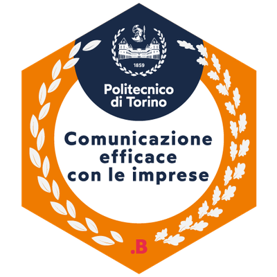

# Hello, I'm Luigi Di Maggio 👋

I'm Research Assistant at the Department of Mechanical and Aerospace Engineering of Politecnico di Torino.

I am a Mechanical Engineer with PhD on Artificial Intelligence applied to machine fault diagnosis. My PhD project research focused on employing cycleGANs for synthetic data generation and transfer learning to transfer knowledge from sound recognition CNNs to bearing fault detection. 

I am passionate about AI and its applications in mechanical engineering, exploring how it can be integrated with classical approaches to enhance capabilities, especially concerning rotating systems, industrial applications, and system diagnosis, with a particular emphasis on bearings.

## 🚀 Current Goals

- Generalizing diagnosis models for broader applications.
- Spreading know-how and promoting digital transformation in the industrial sector through AI.
- Facilitating the digitalization of industry in the AI sector.
- Involving students and recent graduates in innovative projects through theses and research collaborations.

## 🔭 I’m currently working on

- **Synthetic Data Generation**: Creating synthetic dataset in the form of time-domain signals for damaged machinery.
- **Explainable AI**: Improve the interpretability of black-box diagnosis models for root cause analsysis.
- **Multibody Modeling**: Developing models for damage in machine components and the resulting dynamic interactions.

## 🌱 I’m currently learning

- Advanced techniques in AI for predictive maintenance.
- LLMs and Transformers.

## 👯 I’m looking to collaborate on

- Projects with research centers, universities, and companies that seek collaboration for developing ideas or consulting on specific tasks.

## 🤔 I’m looking for help with

- Applying models to new completely unsees mechanical equipments.

## 💬 Ask me about

- AI applications in mechanical engineering.
- How AI can be integrated with classical engineering approaches.

## 📫 How to reach me

- Email: luigi.dimaggio@polito.it
- LinkedIn: https://it.linkedin.com/in/luigi-gianpio-di-maggio

## 💼 Skills

- **Programming & Tools**: Python, MATLAB
- **AI & Machine Learning**:
  - Feature extraction
  - CNNs
  - Transfer Learning
  - Generative Adversarial Networks (GANs)
  - Generative AI
  - Synthetic Data Generation
- **Mechanical Engineering & Diagnosis**:
  - Signal Processing
  - Condition Monitoring
  - Bearing Testing
  - Finite Element Method (FEM)
  - Computational Fluid Dynamics (CFD)
  - Fluid-Structure Interaction
  - Machine design
  - Solidworks CAD

## 📚 Publications

- **Zero-Shot Generative AI for Rotating Machinery Fault Diagnosis: Synthesizing Highly Realistic Training Data via Cycle-Consistent Adversarial Networks**: [Read](https://www.mdpi.com/2076-3417/13/22/12458)
  - Generate synthetic data for damaged machines by using simple simulation models and cycleGANs (image-to-image conversion).

- **Intelligent Fault Diagnosis of Industrial Bearings Using Transfer Learning and CNNs Pre-Trained for Audio Classification**: [Read](https://www.mdpi.com/1424-8220/23/1/211)
  - Using large sound detection network on bearing vibrations dataset to detect faults.

- **Explainable AI for Machine Fault Diagnosis: Understanding Features’ Contribution in Machine Learning Models for Industrial Condition Monitoring**: [Read](https://www.mdpi.com/2076-3417/13/4/2038)
  - SHAP values for explain feature importance in SVM/kNN models for bearing fault detection.
 
- **Design of an Innovative Test Rig for Industrial Bearing Monitoring with Self-Balancing Layout**: [Read](https://www.mdpi.com/2075-1702/10/1/54)
  - Large/medium sized bearings test rig.
 
## Badges

